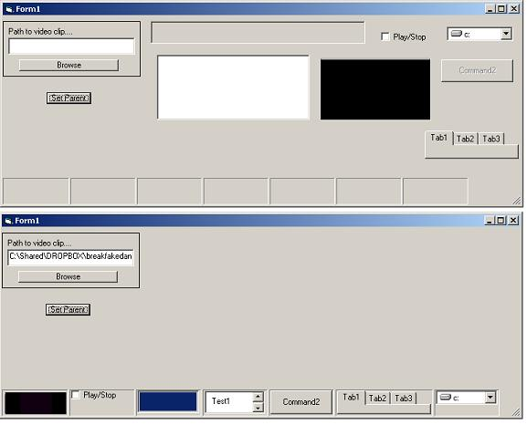



## SetParent Demonstration

### Description

This code demonstrates the use of the SetParent API. IT does this by reparenting controls into a status bar. For instance the mediaplayer control is reparented to the status bar and plays video while there. The code is thoroughly commented to try to make it as easy to understand as possible.

Please vote...
 
### More Info
 
See Code

             |
---                |---
**Submitted On**   |2004-06-24 13:25:54
**By**             |[DasVoldus](https://github.com/Planet-Source-Code/PSCIndex/blob/master/ByAuthor/dasvoldus.md)
**Level**          |Intermediate
**User Rating**    |4.8 (24 globes from 5 users)
**Compatibility**  |VB 5\.0, VB 6\.0
**Category**       |[Windows API Call/ Explanation](https://github.com/Planet-Source-Code/PSCIndex/blob/master/ByCategory/windows-api-call-explanation__1-39.md)
**World**          |[Visual Basic](https://github.com/Planet-Source-Code/PSCIndex/blob/master/ByWorld/visual-basic.md)
**Archive File**   |[SetParent\_1761686242004\.zip](https://github.com/Planet-Source-Code/dasvoldus-setparent-demonstration__1-54574/archive/master.zip)

### API Declarations

See Code

